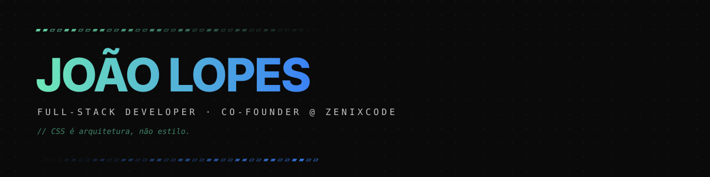

  

  📍 Aracaju, BR · Disponível para <b>CLT no Brasil</b> · <b>remote roles worldwide</b> · <b>freelance premium</b> via <a href="https://zenixcode.com">ZenixCode</a>

 

> [!TIP]
> **Full-stack developer com alma de front-end.**
>
> *Motion é interface, não decoração.*
> *Performance vence trend.*
> *Pixel-perfect não é exagero — é respeito.*

 

## Sobre

Co-fundei a **ZenixCode** pra entregar produto digital com nível de craft que não vem em template — sites premium, plataformas educacionais com IA, sistemas de gestão sob medida.

Trabalho hoje em três frentes: **front-end de alta performance**, **integração de IA em produtos reais**, e o lado de **produto/UX** que decide se a interface entrega ou não.

▰▰▱▱▰▰▱▱▰▰▱▱▰▰▱▱▰▰▱▱▰▰▱▱▰▰▱▱▰▰▱▱▰▰▱▱▰▰▱▱▰▰▱▱

## Stack

### Principal
| Camada | Ferramentas |
|---|---|
| **Front-end** | React · Next.js · TypeScript · Tailwind · Framer Motion · GSAP |
| **Back-end** | Node.js · Fastify · Hono · Express |
| **Banco** | PostgreSQL · MySQL · Prisma |
| **DevOps** | Nginx · Docker · Coolify · Hostinger VPS |
| **Validação & Auth** | Zod · React Hook Form · Auth.js · Better-Auth |
| **IA** | Claude API · OpenAI · Prompt Engineering |

### Confortável também com
Vue.js · Swift (iOS) · Bootstrap · JavaScript vanilla

▰▰▱▱▰▰▱▱▰▰▱▱▰▰▱▱▰▰▱▱▰▰▱▱▰▰▱▱▰▰▱▱▰▰▱▱▰▰▱▱▰▰▱▱

## Em produção / em curso

### [Simulados SEDU](https://github.com/joaolopest/simulados-sedu-frontend)
Plataforma estadual de simulados com IA para a Secretaria de Educação de Sergipe.
`Next.js 16` · `React 19` · `Tailwind v4` · `shadcn/ui`

### [Painel de Votação Realtime](https://github.com/joaolopest/painel-votacao-cajuhub)
Votação em tempo real via Supabase Realtime. DOM cirúrgica sem framework — atualização sub-100ms multiusuário, sem reload.
`Vanilla JS` · `Supabase Realtime` · `WebSockets` · `PostgreSQL`

### [Porto Digital Beira-Mar](https://github.com/joaolopest/PortoDigital-BeiraMar)
Sistema web de gestão para peixaria — estoque, produção, vendas, fluxo de caixa, chat interno.
`HTML/CSS/JS` · `Bootstrap 5`

### [CajuHub Quiz](https://github.com/joaolopest/cajuhub-quiz) — *projeto de mentoria*
Mentorei alunos do programa de formação CajuHub na construção do primeiro quiz interativo deles — do zero ao deploy, em JavaScript puro. Projeto que introduz lógica, DOM e estado sem frameworks.
`Vanilla JS` · `HTML/CSS`

▰▰▱▱▰▰▱▱▰▰▱▱▰▰▱▱▰▰▱▱▰▰▱▱▰▰▱▱▰▰▱▱▰▰▱▱▰▰▱▱▰▰▱▱

## Contato

  <a href="https://linkedin.com/in/joaolopest"><b>LinkedIn</b></a> ·
  <a href="mailto:joaolopest@gmail.com"><b>Email</b></a> ·
  <a href="https://zenixcode.com"><b>ZenixCode</b></a>

 

<i>Aberto a oportunidades · Open to opportunities · CLT BR, remote international, freelance via ZenixCode</i>
